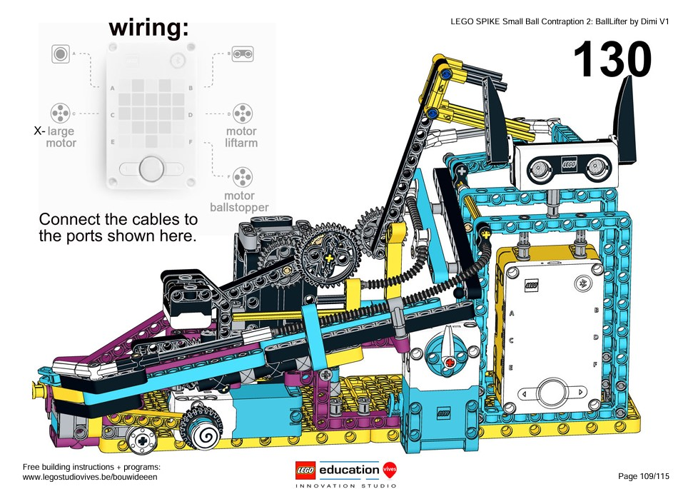
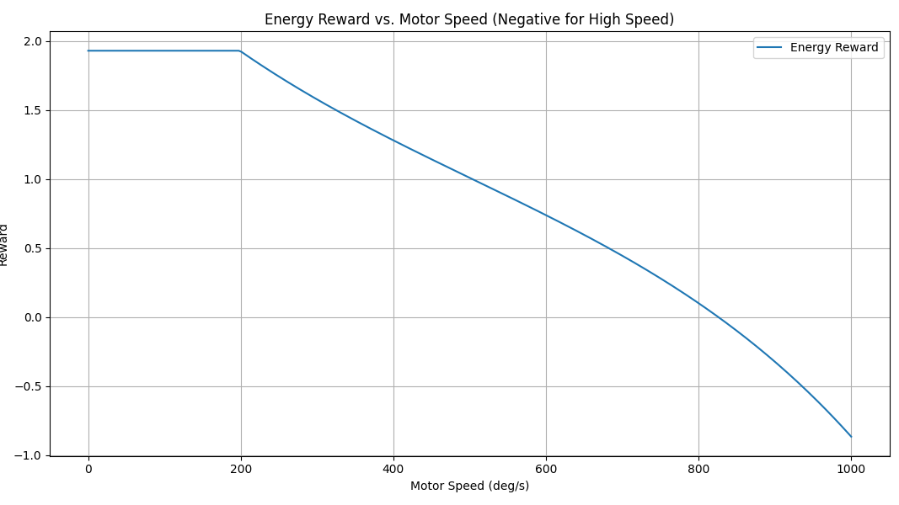
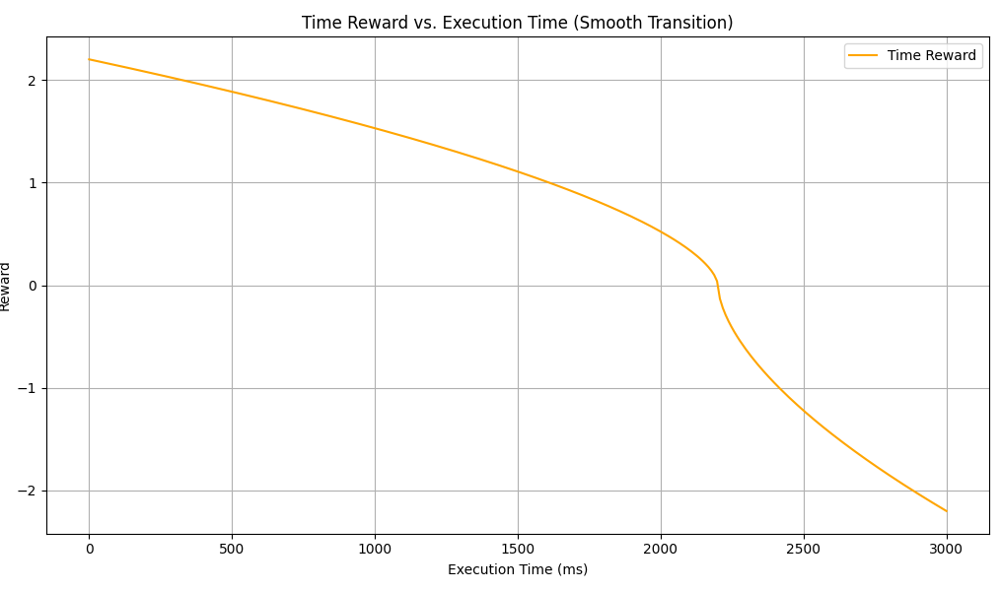
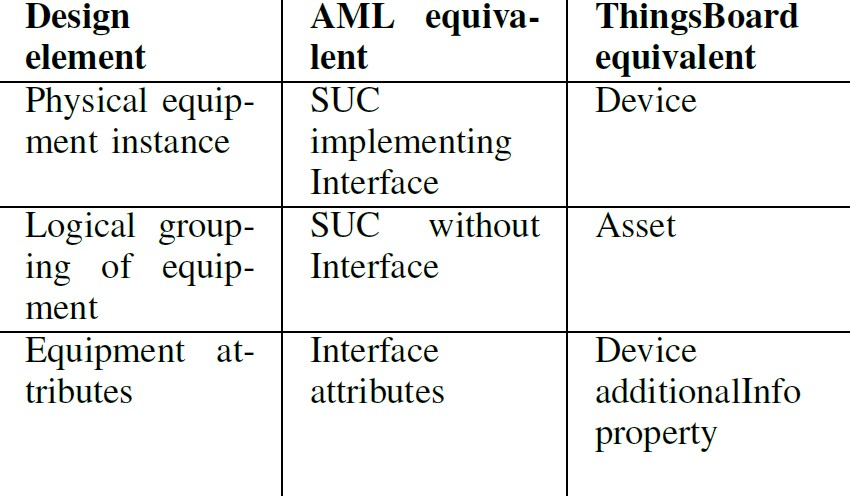
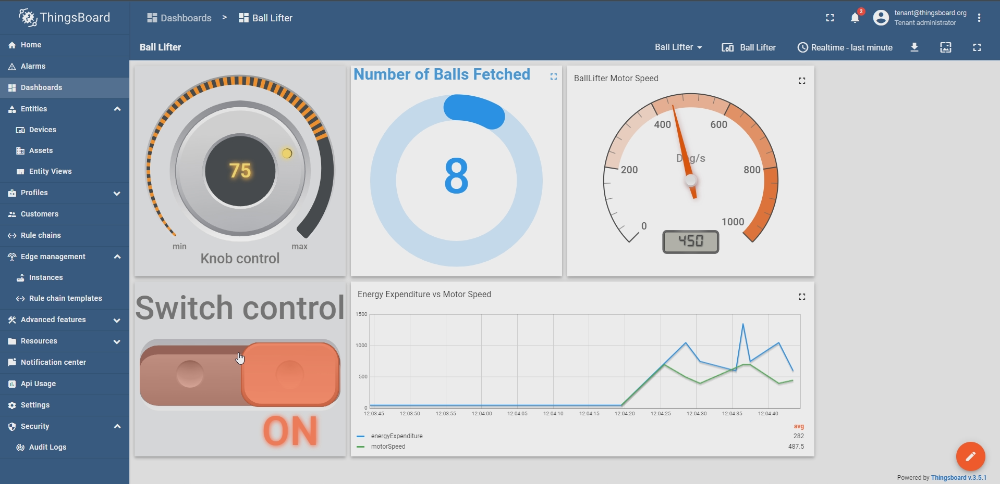

# Diploma Thesis - IoT Applications in Industrial Production Systems

Welcome to the repository of my Diploma Thesis at the Computer Engineering & Informatics Department (CEID), University of Patras. This work addresses the transformative impacts of the Fourth Industrial Revolution on industrial production systems, specifically focusing on the challenges and solutions for integrating Industrial Internet of Things (IIoT) and Cyber-Physical Systems (CPS).

## Abstract

The Fourth Industrial Revolution is rapidly transforming industry, driven by technologies like the Industrial Internet of Things (IIoT) and Cyber-Physical Systems (CPS). Integrating these technologies into existing production environments poses challenges due to heterogeneous equipment, legacy systems, and the need for interoperability between diverse IoT devices. This thesis proposes an innovative approach to address these challenges by leveraging AutomationML and IoT platforms for streamlined integration and management. AutomationML is utilized to model the industrial production environment, providing a standardized representation. Using the LEGO SPIKE Prime kit, a robot was built that simulates a real IoT device, presenting the above modeling. This robot incorporates two Q-learning algorithms for adaptive behavior: one based on Boltzmann’s distribution and another which sets dynamic reward thresholds and employs a weighted action choice mechanism. These algorithms were designed to optimize the robot’s actions under varying conditions, and a comprehensive evaluation of their performance is presented, focusing on convergence speed and adaptability. Furthermore, a Python script facilitated translation of the AutomationML model into entities within the ThingsBoard IoT platform. Bidirectional communication between the robot and ThingsBoard was established using a variety of communication technologies like MQTT, and REST APIs, allowing for seamless device monitoring and control. This thesis demonstrates the effectiveness of using AutomationML modeling in conjunction with IoT platforms to enhance the integration of IoT applications in industrial production systems. The proposed approach contributes to a more flexible, efficient, and scalable IIoT deployment strategy within industry.

**Keywords**: Fourth Industrial Revolution, Interoperability, Cyber-Physical Systems (CPS), IoT, IIoT, AutomationML, ThingsBoard, Q-Learning

## [LEGO SPIKE Prime](https://spike.legoeducation.com/)

The robot created is the one shown in the image below:

Building instructions can be found [here.](www.legostudiovives.be/bouwideeen)

SPIKE was programmed using Pybricks, a Python programming platform for smart LEGO Hubs.

### Q-Learning

This robot incorporates two Q-learning algorithms for adaptive behavior that can be found in the [Pybricks](./Pybricks%20Programms/) folder:

1. Based on Boltzmann’s distribution
2. Based on dynamic reward thresholds and a weighted action choice mechanism

Both algorithms serve a common purpose: to determine the optimal lifting speed of the robots lifting arm for balls of different weights. Determining the optimal lifting speed requires a delicate balance between competing factors:

1. **Energy Efficiency**
   

2. **Time Efficiency**
   

## AutomationML to ThingsBoard Entities

A python script was implemented ([json2tb.py](./Python/json2tb.py)) that takes a JSON file of an AutomationML Instance Hierarchy (convert the .aml file to JSON format) and creates the corresponding entities in ThingsBoard based on the model below:

## Bi-directional communication between ThingsBoard and LEGO SPIKE Prime

Communication between the LEGO Robot and the PC was achieved via Bluetooth. Communication between the ThingsBoard platform and the PC was achieved via ThingsBoard's REST API and the MQTT protocol. All these are implmented in a single python [script](./Python/bidirectional.py).

Users can interact with and monitor the robot through a user-friendly ThingsBoard dashboard, providing both control capabilities and visual feedback on the robot's performance.

